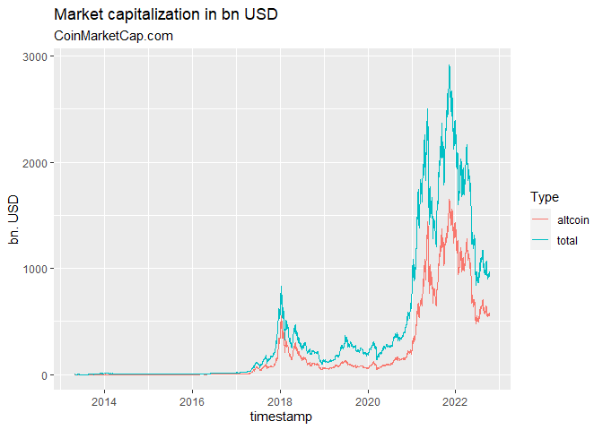

<!-- README.md is generated from README.Rmd. Please edit that file -->

# crypto2 <a href='https://github.com/sstoeckl/crypto2'></a>

<!-- badges: start -->

[](https://www.repostatus.org/#active)
[](https://travis-ci.org/sstoeckl/crypto2)
[](https://CRAN.R-project.org/package=crypto2)
[](https://cran.r-project.org/package=crypto2)
[](https://cran.r-project.org/package=crypto2)
[](https://cran.r-project.org/package=crypto2)
<!-- badges: end -->

# Historical Cryptocurrency Prices for Active and Delisted Tokens!

This is a modification of the original `crypto` package by [jesse
vent](https://github.com/JesseVent/crypto). It is entirely set up to use
means from the `tidyverse` and provides `tibble`s with all data
available via the web-api of
[coinmarketcap.com](https://coinmarketcap.com/). **It does not require
an API key but in turn only provides information that is also available
through the website of
[coinmarketcap.com](https://coinmarketcap.com/).**

It allows the user to retrieve

-   `crypto_listings()` a list of all coins that were historically
    listed on CMC (main dataset to avoid delisting bias) according to
    the [CMC API
    documentation](https://coinmarketcap.com/api/documentation/v1/#operation/getV1CryptocurrencyListingsHistorical)
-   `crypto_list()` a list of all coins that are listed as either being
    *active*, *delisted* or *untracked* according to the [CMC API
    documentation](https://coinmarketcap.com/api/documentation/v1/#operation/getV1CryptocurrencyMap)
-   `crypto_info()` a list of all information available for all
    available coins according to the [CMC API
    documentation](https://coinmarketcap.com/api/documentation/v1/#operation/getV1CryptocurrencyInfo)
-   `crypto_history()` the **most powerful** function of this package
    that allows to download the entire available history for all coins
    covered by CMC according to the [CMC API
    documentation](https://coinmarketcap.com/api/documentation/v1/#operation/getV1CryptocurrencyOhlcvHistorical)
-   `crypto_global_quotes()` a dataset of historical global crypto
    currency market metrics to the [CMC API
    documentation](https://coinmarketcap.com/api/documentation/v1/#operation/getV1GlobalmetricsQuotesHistorical)
-   `fiat_list()` a mapping of all fiat currencies (plus precious
    metals) available via the [CMC WEB
    API](https://coinmarketcap.com/api/documentation/v1/#operation/getV1FiatMap)
-   `exchange_list()` a list of all exchanges available as either being
    *active*, *delisted* or *untracked* according to the [CMC API
    documentation](https://coinmarketcap.com/api/documentation/v1/#operation/getV1ExchangeMap)
-   `exchange_info()` a list of all information available for all given
    exchanges according to the [CMC API
    documentation](https://coinmarketcap.com/api/documentation/v1/#operation/getV1ExchangeInfo)

# Update

Since version 1.4.5 I have added a new function `crypto_global_quotes()`
which retrieves global aggregate market statistics for CMC. There also
were some bugs fixed.

Since version 1.4.4 a new function `crypto_listings()` was introduced
that retrieves new/latest/historical listings and listing information at
CMC. Additionally some aspects of the other functions have been
reworked. We noticed that `finalWait = TRUE` does not seem to be
necessary at the moment, as well as `sleep` can be set to ‘0’ seconds.
If you experience strange behavior this might be due to the the api
sending back strange (old) results. In this case let `sleep = 60` (the
default) and `finalWait = TRUE` (the default).

Since version 1.4.0 the package has been reworked to retrieve as many
assets as possible with one api call, as there is a new “feature”
introduced by CMC to send back the initially requested data for each api
call within 60 seconds. So one needs to wait 60s before calling the api
again. Additionally, since version v1.4.3 the package allows for a data
`interval` larger than daily (e.g. ‘2d’ or ‘7d’/‘weekly’)

## Installation

You can install `crypto2` from CRAN with

``` r
install.packages("crypto2")
```

or directly from github with:

``` r
# install.packages("devtools")
devtools::install_github("sstoeckl/crypto2")
```

## Package Contribution

The package provides API free and efficient access to all information
from <https://coinmarketcap.com> that is also available through their
website. It uses a variety of modification and web-scraping tools from
the `tidyverse` (especially `purrr`).

As this provides access not only to **active** coins but also to those
that have now been **delisted** and also those that are categorized as
**untracked**, including historical pricing information, this package
provides a valid basis for any **Asset Pricing Studies** based on crypto
currencies that require **survivorship-bias-free** information. In
addition to that, the package maintainer is currently working on also
providing **delisting returns** (similarly to CRSP for stocks) to also
eliminate the **delisting bias**.

## Package Usage

First we load the `crypto2`-package and download the set of active coins
from <https://coinmarketcap.com> (additionally one could load delisted
coins with `only_Active=FALSE` as well as untracked coins with
`add_untracked=TRUE`).

``` r
library(crypto2)
library(dplyr)
#> 
#> Attache Paket: 'dplyr'
#> Die folgenden Objekte sind maskiert von 'package:stats':
#> 
#>     filter, lag
#> Die folgenden Objekte sind maskiert von 'package:base':
#> 
#>     intersect, setdiff, setequal, union

# List all active coins
coins <- crypto_list(only_active=TRUE)
```

Next we download information on the first three coins from that list.

``` r
# retrieve information for all (the first 3) of those coins
coin_info <- crypto_info(coins, limit=3, finalWait=FALSE)
#> ❯ Scraping crypto info
#> 
#> Scraping  https://web-api.coinmarketcap.com/v1/cryptocurrency/info?id=1,2,3  with  65  characters!
#> ❯ Processing crypto info
#> 

# and give the first two lines of information per coin
coin_info
#> # A tibble: 3 × 19
#>      id name   symbol categ…¹ descr…² slug  logo  subre…³ notice date_…⁴ twitt…⁵
#> * <int> <chr>  <chr>  <chr>   <chr>   <chr> <chr> <chr>   <chr>  <chr>   <chr>  
#> 1     1 Bitco… BTC    coin    "## Wh… bitc… http… bitcoin ""     2013-0… ""     
#> 2     2 Litec… LTC    coin    "## Wh… lite… http… liteco… ""     2013-0… "Litec…
#> 3     3 Namec… NMC    coin    "Namec… name… http… nameco… ""     2013-0… "Namec…
#> # … with 8 more variables: is_hidden <int>, date_launched <lgl>,
#> #   self_reported_circulating_supply <lgl>, self_reported_market_cap <lgl>,
#> #   tags <list>, self_reported_tags <lgl>, urls <list>, platform <list>, and
#> #   abbreviated variable names ¹​category, ²​description, ³​subreddit,
#> #   ⁴​date_added, ⁵​twitter_username
```

In a next step we show the logos of the three coins as provided by
<https://coinmarketcap.com>.


In addition we show tags provided by <https://coinmarketcap.com>.

``` r
coin_info %>% select(slug,tags) %>% tidyr::unnest(tags) %>% group_by(slug) %>% slice(1,n())
#> # A tibble: 6 × 2
#> # Groups:   slug [3]
#>   slug     tags              
#>   <chr>    <chr>             
#> 1 bitcoin  mineable          
#> 2 bitcoin  paradigm-portfolio
#> 3 litecoin mineable          
#> 4 litecoin medium-of-exchange
#> 5 namecoin mineable          
#> 6 namecoin platform
```

Additionally: Here are some urls pertaining to these coins as provided
by <https://coinmarketcap.com>.

``` r
coin_info %>% select(slug,urls) %>% tidyr::unnest(urls) %>% filter(name %in% c("reddit","twitter"))
#> # A tibble: 5 × 3
#>   slug     name    url                                
#>   <chr>    <chr>   <chr>                              
#> 1 bitcoin  reddit  https://reddit.com/r/bitcoin       
#> 2 litecoin twitter https://twitter.com/LitecoinProject
#> 3 litecoin reddit  https://reddit.com/r/litecoin      
#> 4 namecoin twitter https://twitter.com/Namecoin       
#> 5 namecoin reddit  https://reddit.com/r/namecoin
```

In a next step we download time series data for these coins.

``` r
# retrieve historical data for all (the first 3) of them
coin_hist <- crypto_history(coins, limit=3, start_date="20210101", end_date="20210105", finalWait=FALSE)
#> ❯ Scraping historical crypto data
#> 
#> ❯ Processing historical crypto data
#> 

# and give the first two times of information per coin
coin_hist %>% group_by(slug) %>% slice(1:2)
#> # A tibble: 6 × 16
#> # Groups:   slug [3]
#>   timestamp              id slug    name  symbol ref_cur    open    high     low
#>   <dttm>              <int> <chr>   <chr> <chr>  <chr>     <dbl>   <dbl>   <dbl>
#> 1 2021-01-01 23:59:59     1 bitcoin Bitc… BTC    USD     2.90e+4 2.96e+4 2.88e+4
#> 2 2021-01-02 23:59:59     1 bitcoin Bitc… BTC    USD     2.94e+4 3.32e+4 2.91e+4
#> 3 2021-01-01 23:59:59     2 liteco… Lite… LTC    USD     1.25e+2 1.33e+2 1.23e+2
#> 4 2021-01-02 23:59:59     2 liteco… Lite… LTC    USD     1.26e+2 1.40e+2 1.24e+2
#> 5 2021-01-01 23:59:59     3 nameco… Name… NMC    USD     4.39e-1 4.63e-1 4.32e-1
#> 6 2021-01-02 23:59:59     3 nameco… Name… NMC    USD     4.51e-1 5.10e-1 4.15e-1
#> # … with 7 more variables: close <dbl>, volume <dbl>, market_cap <dbl>,
#> #   time_open <dttm>, time_close <dttm>, time_high <dttm>, time_low <dttm>
```

Similarly, we could download the same data on a monthly basis.

``` r
# retrieve historical data for all (the first 3) of them
coin_hist_m <- crypto_history(coins, limit=3, start_date="20210101", end_date="20210501", interval ="monthly", finalWait=FALSE)
#> ❯ Scraping historical crypto data
#> 
#> ❯ Processing historical crypto data
#> 

# and give the first two times of information per coin
coin_hist_m %>% group_by(slug) %>% slice(1:2)
#> # A tibble: 6 × 16
#> # Groups:   slug [3]
#>   timestamp              id slug    name  symbol ref_cur    open    high     low
#>   <dttm>              <int> <chr>   <chr> <chr>  <chr>     <dbl>   <dbl>   <dbl>
#> 1 2021-01-01 23:59:59     1 bitcoin Bitc… BTC    USD     2.90e+4 2.96e+4 2.88e+4
#> 2 2021-02-01 23:59:59     1 bitcoin Bitc… BTC    USD     3.31e+4 3.46e+4 3.24e+4
#> 3 2021-01-01 23:59:59     2 liteco… Lite… LTC    USD     1.25e+2 1.33e+2 1.23e+2
#> 4 2021-02-01 23:59:59     2 liteco… Lite… LTC    USD     1.30e+2 1.36e+2 1.26e+2
#> 5 2021-01-01 23:59:59     3 nameco… Name… NMC    USD     4.39e-1 4.63e-1 4.32e-1
#> 6 2021-02-01 23:59:59     3 nameco… Name… NMC    USD     7.82e-1 8.05e-1 7.48e-1
#> # … with 7 more variables: close <dbl>, volume <dbl>, market_cap <dbl>,
#> #   time_open <dttm>, time_close <dttm>, time_high <dttm>, time_low <dttm>
```

Alternatively, we could determine the price of these coins in other
currencies. A list of such currencies is available as `fiat_list()`

``` r
fiats <- fiat_list()
fiats
#> # A tibble: 93 × 4
#>       id name                 sign  symbol
#>    <int> <chr>                <chr> <chr> 
#>  1  2781 United States Dollar $     USD   
#>  2  2782 Australian Dollar    $     AUD   
#>  3  2783 Brazilian Real       R$    BRL   
#>  4  2784 Canadian Dollar      $     CAD   
#>  5  2785 Swiss Franc          Fr    CHF   
#>  6  2786 Chilean Peso         $     CLP   
#>  7  2787 Chinese Yuan         ¥     CNY   
#>  8  2788 Czech Koruna         Kč    CZK   
#>  9  2789 Danish Krone         kr    DKK   
#> 10  2790 Euro                 €     EUR   
#> # … with 83 more rows
```

So we download the time series again depicting prices in terms of
Bitcoin and Euro (note that multiple currencies can be given to
`convert`, separated by “,”).

``` r
# retrieve historical data for all (the first 3) of them
coin_hist2 <- crypto_history(coins, convert="BTC,EUR", limit=3, start_date="20210101", end_date="20210105", finalWait=FALSE)
#> ❯ Scraping historical crypto data
#> 
#> ❯ Processing historical crypto data
#> 

# and give the first two times of information per coin
coin_hist2 %>% group_by(slug,ref_cur) %>% slice(1:2)
#> # A tibble: 12 × 16
#> # Groups:   slug, ref_cur [6]
#>    timestamp              id slug   name  symbol ref_cur    open    high     low
#>    <dttm>              <int> <chr>  <chr> <chr>  <chr>     <dbl>   <dbl>   <dbl>
#>  1 2021-01-01 23:59:43     1 bitco… Bitc… BTC    BTC     1   e+0 1.00e+0 9.98e-1
#>  2 2021-01-02 23:59:43     1 bitco… Bitc… BTC    BTC     1   e+0 1.00e+0 9.99e-1
#>  3 2021-01-01 23:59:06     1 bitco… Bitc… BTC    EUR     2.37e+4 2.43e+4 2.36e+4
#>  4 2021-01-02 23:59:06     1 bitco… Bitc… BTC    EUR     2.42e+4 2.73e+4 2.40e+4
#>  5 2021-01-01 23:59:43     2 litec… Lite… LTC    BTC     4.30e-3 4.56e-3 4.27e-3
#>  6 2021-01-02 23:59:43     2 litec… Lite… LTC    BTC     4.30e-3 4.24e-3 4.23e-3
#>  7 2021-01-01 23:59:06     2 litec… Lite… LTC    EUR     1.02e+2 1.09e+2 1.01e+2
#>  8 2021-01-02 23:59:06     2 litec… Lite… LTC    EUR     1.04e+2 1.16e+2 1.02e+2
#>  9 2021-01-01 23:59:43     3 namec… Name… NMC    BTC     1.51e-5 1.58e-5 1.50e-5
#> 10 2021-01-02 23:59:43     3 namec… Name… NMC    BTC     1.54e-5 1.57e-5 1.31e-5
#> 11 2021-01-01 23:59:06     3 namec… Name… NMC    EUR     3.60e-1 3.80e-1 3.54e-1
#> 12 2021-01-02 23:59:06     3 namec… Name… NMC    EUR     3.71e-1 4.21e-1 3.41e-1
#> # … with 7 more variables: close <dbl>, volume <dbl>, market_cap <dbl>,
#> #   time_open <dttm>, time_close <dttm>, time_high <dttm>, time_low <dttm>
```

As a new features in version 1.4.4. we introduced the possibility to
download historical listings and listing information (add
`quote = TRUE`).

``` r
latest_listings <- crypto_listings(which="latest", limit=10, quote=TRUE, finalWait=FALSE)
latest_listings
#> # A tibble: 10 × 23
#>       id name    symbol slug  self_…¹ self_…² tvl_r…³ last_upd…⁴ USD_p…⁵ USD_v…⁶
#>    <int> <chr>   <chr>  <chr> <lgl>   <lgl>   <lgl>   <date>       <dbl>   <dbl>
#>  1     1 Bitcoin BTC    bitc… NA      NA      NA      2022-10-19 1.92e+4 2.36e10
#>  2    52 XRP     XRP    xrp   NA      NA      NA      2022-10-19 4.62e-1 1.33e 9
#>  3    74 Dogeco… DOGE   doge… NA      NA      NA      2022-10-19 5.99e-2 2.53e 8
#>  4   825 Tether  USDT   teth… NA      NA      NA      2022-10-19 1.00e+0 3.33e10
#>  5  1027 Ethere… ETH    ethe… NA      NA      NA      2022-10-19 1.29e+3 8.45e 9
#>  6  1839 BNB     BNB    bnb   NA      NA      NA      2022-10-19 2.73e+2 4.98e 8
#>  7  2010 Cardano ADA    card… NA      NA      NA      2022-10-19 3.57e-1 4.15e 8
#>  8  3408 USD Co… USDC   usd-… NA      NA      NA      2022-10-19 1.00e+0 2.61e 9
#>  9  4687 Binanc… BUSD   bina… NA      NA      NA      2022-10-19 1.00e+0 5.91e 9
#> 10  5426 Solana  SOL    sola… NA      NA      NA      2022-10-19 2.97e+1 6.38e 8
#> # … with 13 more variables: USD_volume_change_24h <dbl>,
#> #   USD_percent_change_1h <dbl>, USD_percent_change_24h <dbl>,
#> #   USD_percent_change_7d <dbl>, USD_percent_change_30d <dbl>,
#> #   USD_percent_change_60d <dbl>, USD_percent_change_90d <dbl>,
#> #   USD_market_cap <dbl>, USD_market_cap_dominance <dbl>,
#> #   USD_fully_diluted_market_cap <dbl>, USD_tvl <lgl>,
#> #   USD_market_cap_by_total_supply <dbl>, USD_last_updated <chr>, and …
```

An additional feature that was added in version 1.4.5 retrieves global
aggregate market statistics for CMC.

``` r
all_quotes <- crypto_global_quotes(which="historical", quote=TRUE)
all_quotes
#> # A tibble: 3,453 × 12
#>    timestamp  btc_domi…¹ activ…² activ…³ activ…⁴ USD_t…⁵ USD_t…⁶ USD_t…⁷ USD_a…⁸
#>    <date>          <dbl>   <int>   <int>   <int>   <dbl>   <dbl>   <dbl>   <dbl>
#>  1 2013-04-29       94.2      NA      NA      NA  1.58e9       0      NA  9.19e7
#>  2 2013-04-30       94.4      NA      NA      NA  1.69e9       0      NA  9.47e7
#>  3 2013-05-01       94.4      NA      NA      NA  1.64e9       0      NA  9.24e7
#>  4 2013-05-02       94.1      NA      NA      NA  1.33e9       0      NA  7.90e7
#>  5 2013-05-03       94.2      NA      NA      NA  1.28e9       0      NA  7.45e7
#>  6 2013-05-04       93.9      NA      NA      NA  1.17e9       0      NA  7.16e7
#>  7 2013-05-05       94.0      NA      NA      NA  1.34e9       0      NA  8.07e7
#>  8 2013-05-06       94.1      NA      NA      NA  1.37e9       0      NA  8.12e7
#>  9 2013-05-07       94.4      NA      NA      NA  1.31e9       0      NA  7.38e7
#> 10 2013-05-08       94.4      NA      NA      NA  1.32e9       0      NA  7.43e7
#> # … with 3,443 more rows, 3 more variables: USD_altcoin_volume_24h <dbl>,
#> #   USD_altcoin_volume_24h_reported <dbl>, USD_timestamp <chr>, and abbreviated
#> #   variable names ¹​btc_dominance, ²​active_cryptocurrencies, ³​active_exchanges,
#> #   ⁴​active_market_pairs, ⁵​USD_total_market_cap, ⁶​USD_total_volume_24h,
#> #   ⁷​USD_total_volume_24h_reported, ⁸​USD_altcoin_market_cap
```

We can use those quotes to plot information on the aggregate market
capitalization:

``` r
all_quotes %>% select(timestamp, USD_total_market_cap, USD_altcoin_market_cap) %>% 
  tidyr::pivot_longer(cols = 2:3, names_to = "Market Cap", values_to = "bn. USD") %>% 
  tidyr::separate(`Market Cap`,into = c("Currency","Type","Market","Cap")) %>% 
  dplyr::mutate(`bn. USD`=`bn. USD`/1000000000) %>% 
  ggplot2::ggplot(ggplot2::aes(x=timestamp,y=`bn. USD`,color=Type)) + ggplot2::geom_line() +
  ggplot2::labs(title="Market capitalization in bn USD", subtitle="CoinMarketCap.com")
```

<!-- -->

Last and least, one can get information on exchanges. For this download
a list of active/inactive/untracked exchanges using `exchange_list()`:

``` r
exchanges <- exchange_list(only_active=TRUE)
exchanges
#> # A tibble: 527 × 6
#>       id name         slug         is_active first_historical_data last_histor…¹
#>    <int> <chr>        <chr>            <int> <date>                <date>       
#>  1    16 Poloniex     poloniex             1 2018-04-26            2022-10-19   
#>  2    21 BTCC         btcc                 1 2018-04-26            2022-10-19   
#>  3    22 Bittrex      bittrex              1 2018-04-26            2022-10-19   
#>  4    24 Kraken       kraken               1 2018-04-26            2022-10-19   
#>  5    34 Bittylicious bittylicious         1 2018-04-26            2022-10-19   
#>  6    36 CEX.IO       cex-io               1 2018-04-26            2022-10-19   
#>  7    37 Bitfinex     bitfinex             1 2018-04-26            2022-10-19   
#>  8    42 HitBTC       hitbtc               1 2018-04-26            2022-10-19   
#>  9    50 EXMO         exmo                 1 2018-04-26            2022-10-19   
#> 10    61 Okcoin       okcoin               1 2018-04-26            2022-10-19   
#> # … with 517 more rows, and abbreviated variable name ¹​last_historical_data
```

and then download information on “binance” and “bittrex”:

``` r
ex_info <- exchange_info(exchanges %>% filter(slug %in% c('binance','bittrex')), finalWait=FALSE)
#> ❯ Scraping exchange info
#> 
#> Scraping exchanges from  https://web-api.coinmarketcap.com/v1/exchange/info?id=22,270  with  60  characters!
#> ❯ Processing exchange info
#> 
ex_info
#> # A tibble: 2 × 19
#>      id name    slug  descr…¹ notice logo  type  date_…² is_hi…³ is_re…⁴ maker…⁵
#> * <int> <chr>   <chr> <chr>   <chr>  <chr> <chr> <chr>     <int> <lgl>     <dbl>
#> 1    22 Bittrex bitt…  <NA>   ""     http… ""    2014-0…       0 NA         0   
#> 2   270 Binance bina… "## Wh… "Bina… http… ""    2017-0…       0 NA         0.02
#> # … with 8 more variables: taker_fee <dbl>, spot_volume_usd <dbl>,
#> #   spot_volume_last_updated <dttm>, weekly_visits <int>, tags <lgl>,
#> #   urls <list>, countries <lgl>, fiats <list>, and abbreviated variable names
#> #   ¹​description, ²​date_launched, ³​is_hidden, ⁴​is_redistributable, ⁵​maker_fee
```

Then we can access information on the fee structure,

``` r
ex_info %>% select(contains("fee"))
#> # A tibble: 2 × 2
#>   maker_fee taker_fee
#>       <dbl>     <dbl>
#> 1      0         0   
#> 2      0.02      0.04
```

the amount of cryptocurrencies being traded (in USD)

``` r
ex_info %>% select(contains("spot"))
#> # A tibble: 2 × 2
#>   spot_volume_usd spot_volume_last_updated
#>             <dbl> <dttm>                  
#> 1       15170263. 2022-10-19 20:15:16     
#> 2    11045438701. 2022-10-19 20:15:16
```

or the fiat currencies allowed:

``` r
ex_info %>% select(slug,fiats) %>% tidyr::unnest(fiats)
#> # A tibble: 47 × 2
#>    slug    value
#>    <chr>   <chr>
#>  1 bittrex USD  
#>  2 binance AED  
#>  3 binance ARS  
#>  4 binance AUD  
#>  5 binance AZN  
#>  6 binance BRL  
#>  7 binance CAD  
#>  8 binance CHF  
#>  9 binance CLP  
#> 10 binance COP  
#> # … with 37 more rows
```

### Author/License

-   **Sebastian Stöckl** - Package Creator, Modifier & Maintainer -
    [sstoeckl on github](https://github.com/sstoeckl)

This project is licensed under the MIT License - see the \<license.md\>
file for details\</license.md\>

### Acknowledgments

-   Thanks to the team at <https://coinmarketcap.com> for the great work
    they do, especially to [Alice Liu (Research
    Lead)](https://www.linkedin.com/in/alicejingliu/) and [Aaron
    K.](https://www.linkedin.com/in/aaroncwk/) for their support with
    regard to information on delistings.
-   Thanks to Jesse Vent for providing the (not fully research
    compatible) [`crypto`](https://github.com/JesseVent/crypto)-package
    that inspired this package.
