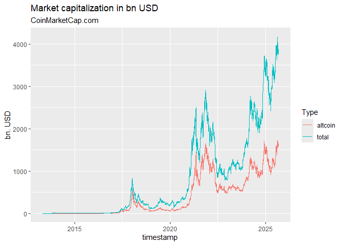

<!-- README.md is generated from README.Rmd. Please edit that file -->

# crypto2 <a href='https://github.com/sstoeckl/crypto2'></a>

<!-- badges: start -->

[](https://www.repostatus.org/#active)
[](https://github.com/sstoeckl/crypto2/actions/workflows/R-CMD-check.yaml)
[](https://github.com/sstoeckl/crypto2/actions/workflows/test-coverage.yaml)
[](https://github.com/sstoeckl/crypto2/actions/workflows/pr-commands.yaml)
[](https://cran.r-project.org/package=crypto2)
[](https://CRAN.R-project.org/package=crypto2)
[](https://cran.r-project.org/package=crypto2)
[](https://cran.r-project.org/package=crypto2)
[](https://cran.r-project.org/package=crypto2)
[](https://lifecycle.r-lib.org/articles/stages.html#stable)
[](https://sstoeckl.github.io/crypto2/)
<!-- badges: end -->

# Historical Cryptocurrency Prices for Active and Delisted Tokens!

This is a modification of the original `crypto` package by [jesse
vent](https://github.com/JesseVent/crypto). It is entirely set up to use
means from the `tidyverse` and provides `tibble`s with all data
available via the web-api of
[coinmarketcap.com](https://coinmarketcap.com/). **It does not require
an API key but in turn only provides information that is also available
through the website of
[coinmarketcap.com](https://coinmarketcap.com/).**

It allows the user to retrieve

- `crypto_listings()` a list of all coins that were historically listed
  on CMC (main dataset to avoid delisting bias) according to the [CMC
  API
  documentation](https://coinmarketcap.com/api/documentation/v1/#operation/getV1CryptocurrencyListingsHistorical)
- `crypto_list()` a list of all coins that are listed as either being
  *active*, *delisted* or *untracked* according to the [CMC API
  documentation](https://coinmarketcap.com/api/documentation/v1/#operation/getV1CryptocurrencyMap)
- `crypto_info()` a list of all information available for all available
  coins according to the [CMC API
  documentation](https://coinmarketcap.com/api/documentation/v1/#operation/getV1CryptocurrencyInfo)
- `crypto_history()` the **most powerful** function of this package that
  allows to download the entire available history for all coins covered
  by CMC according to the [CMC API
  documentation](https://coinmarketcap.com/api/documentation/v1/#operation/getV1CryptocurrencyOhlcvHistorical)
- `crypto_global_quotes()` a dataset of historical global crypto
  currency market metrics to the [CMC API
  documentation](https://coinmarketcap.com/api/documentation/v1/#operation/getV1GlobalmetricsQuotesHistorical)
- `fiat_list()` a mapping of all fiat currencies (plus precious metals)
  available via the [CMC WEB
  API](https://coinmarketcap.com/api/documentation/v1/#operation/getV1FiatMap)
- `exchange_list()` a list of all exchanges available as either being
  *active*, *delisted* or *untracked* according to the [CMC API
  documentation](https://coinmarketcap.com/api/documentation/v1/#operation/getV1ExchangeMap)
- `exchange_info()` a list of all information available for all given
  exchanges according to the [CMC API
  documentation](https://coinmarketcap.com/api/documentation/v1/#operation/getV1ExchangeInfo)

# Update

## Version 2.0.2 (August 2024)

Slight change in api output broke `crypto_info()` (new additional
column). Fixed.

## Version 2.0.1 (July 2024)

Slight change in api output broke `crypto_info()`. Fixed.

## Version 2.0.0 (May 2024)

After a major change in the api structure of coinmarketcap.com, the
package had to be rewritten. As a result, many functions had to be
rewritten, because data was not available any more in a similar format
or with similar accuracy. Unfortunately, this will potentially break
many users implementations. Here is a detailed list of changes:

- `crypto_list()` has been modified and delivers the same data as
  before.
- `exchange_list()` has been modified and delivers the same data as
  before.
- `fiat_list()` has been modified and no longer delivers all available
  currencies and precious metals (therefore only USD and Bitcoin are
  available any more).
- `crypto_listings()` needed to be modified, as multiple base currencies
  are not available any more. Also some of the fields downloaded from
  CMC might have changed. It still retrieves the latest listings, the
  new listings as well as historical listings. The fields returned have
  somewhat slightly changed. Also, no sorting is available any more, so
  if you want to download the top x CCs by market cap, you have to
  download all CCs and then sort them in R.
- `crypto_info()` has been modified, as the data structure has changed.
  The fields returned have somewhat slightly changed.
- `crypto_history()` has been modified. It still retrieves all the OHLC
  history of all the coins, but is slower due to an increased number of
  necessary api calls. The number of available intervals is strongly
  limited, but hourly and daily data is still available. Currently only
  USD and BTC are available as quote currencies through this library.
- `crypto_global_quotes()` has been modified. It still produces a clear
  picture of the global market, but the data structure has somewhat
  slightly changed.

## Version 1.4.7

Since version 1.4.6 I have added the possibility to “sort” the
historical `crypto_listings()` in \_asc_ending or \_desc_ending order
(“sort_dir”) to allow for the possibility to download only the top x
crypto currencies using “limit” based on the requested sort (not
available for “new” sorting). Also corrected some problems when sourcing
lists that now do not have the “last_historical_data” field available
any more.

Since version 1.4.5 I have added a new function `crypto_global_quotes()`
which retrieves global aggregate market statistics for CMC. There also
were some bugs fixed.

Since version 1.4.4 a new function `crypto_listings()` was introduced
that retrieves new/latest/historical listings and listing information at
CMC. Additionally some aspects of the other functions have been
reworked. We noticed that `finalWait = TRUE` does not seem to be
necessary at the moment, as well as `sleep` can be set to ‘0’ seconds.
If you experience strange behavior this might be due to the the api
sending back strange (old) results. In this case let `sleep = 60` (the
default) and `finalWait = TRUE` (the default).

Since version 1.4.0 the package has been reworked to retrieve as many
assets as possible with one api call, as there is a new “feature”
introduced by CMC to send back the initially requested data for each api
call within 60 seconds. So one needs to wait 60s before calling the api
again. Additionally, since version v1.4.3 the package allows for a data
`interval` larger than daily (e.g. ‘2d’ or ‘7d’ or ‘weekly’)

## Installation

You can install `crypto2` from CRAN with

``` r
install.packages("crypto2")
```

or directly from github with:

``` r
# install.packages("devtools")
devtools::install_github("sstoeckl/crypto2")
```

## Package Contribution

The package provides API free and efficient access to all information
from <https://coinmarketcap.com> that is also available through their
website. It uses a variety of modification and web-scraping tools from
the `tidyverse` (especially `purrr`).

As this provides access not only to **active** coins but also to those
that have now been **delisted** and also those that are categorized as
**untracked**, including historical pricing information, this package
provides a valid basis for any **Asset Pricing Studies** based on crypto
currencies that require **survivorship-bias-free** information. In
addition to that, the package maintainer is currently working on also
providing **delisting returns** (similarly to CRSP for stocks) to also
eliminate the **delisting bias**.

## Package Usage

First we load the `crypto2`-package and download the set of active coins
from <https://coinmarketcap.com> (additionally one could load delisted
coins with `only_Active=FALSE` as well as untracked coins with
`add_untracked=TRUE`).

``` r
library(crypto2)
library(dplyr)
#> 
#> Attache Paket: 'dplyr'
#> Die folgenden Objekte sind maskiert von 'package:stats':
#> 
#>     filter, lag
#> Die folgenden Objekte sind maskiert von 'package:base':
#> 
#>     intersect, setdiff, setequal, union

# List all active coins
coins <- crypto_list(only_active=TRUE)
```

Next we download information on the first three coins from that list.

``` r
# retrieve information for all (the first 3) of those coins
coin_info <- crypto_info(coins, limit=3, finalWait=FALSE)
#> ❯ Scraping crypto info
#> 
#> ❯ Processing crypto info
#> 

# and give the first two lines of information per coin
coin_info
#> # A tibble: 3 × 34
#>      id name     symbol slug     category description   date_added status notice
#>   <int> <chr>    <chr>  <chr>    <chr>    <chr>         <date>     <chr>  <chr> 
#> 1     1 Bitcoin  BTC    bitcoin  coin     "## What Is … 2010-07-13 active ""    
#> 2     2 Litecoin LTC    litecoin coin     "## What Is … 2013-04-28 active ""    
#> 3     3 Namecoin NMC    namecoin coin     "Namecoin (N… 2013-04-28 active ""    
#> # ℹ 25 more variables: alert_type <int>, alert_link <chr>,
#> #   latest_update_time <dttm>, watch_list_ranking <int>, date_launched <date>,
#> #   is_audited <lgl>, display_tv <int>, is_infinite_max_supply <int>,
#> #   tv_coin_symbol <chr>, use_faq <lgl>, holders_flag <lgl>,
#> #   ratings_flag <lgl>, analysis_flag <lgl>, socials_flag <lgl>,
#> #   has_extra_info_flag <lgl>, upcoming <named list>, annotation_flag <lgl>,
#> #   tags <list>, crypto_rating <list>, urls <list>, faq_description <list>, …
```

In a next step we show the logos of the three coins as provided by
<https://coinmarketcap.com>.


In addition we show tags provided by <https://coinmarketcap.com>.

``` r
coin_info %>% select(slug,tags) %>% tidyr::unnest(tags) %>% group_by(slug) %>% slice(1,n())
#> # A tibble: 6 × 2
#> # Groups:   slug [3]
#>   slug     tags$slug             $name                    $category
#>   <chr>    <chr>                 <chr>                    <chr>    
#> 1 bitcoin  mineable              "Mineable"               OTHERS   
#> 2 bitcoin  ftx-bankruptcy-estate "FTX Bankruptcy Estate " CATEGORY 
#> 3 litecoin mineable              "Mineable"               OTHERS   
#> 4 litecoin medium-of-exchange    "Medium of Exchange"     INDUSTRY 
#> 5 namecoin mineable              "Mineable"               OTHERS   
#> 6 namecoin platform              "Platform"               CATEGORY
```

Additionally: Here are some urls pertaining to these coins as provided
by <https://coinmarketcap.com>.

``` r
coin_info %>% pull(urls) %>% .[[1]] |> unlist()
#>                            urls.website                      urls.technical_doc 
#>                  "https://bitcoin.org/"       "https://bitcoin.org/bitcoin.pdf" 
#>                          urls.explorer1                          urls.explorer2 
#>              "https://blockchain.info/"     "https://live.blockcypher.com/btc/" 
#>                          urls.explorer3                          urls.explorer4 
#>        "https://blockchair.com/bitcoin"       "https://explorer.viabtc.com/btc" 
#>                          urls.explorer5                        urls.source_code 
#> "https://www.okx.com/web3/explorer/btc"    "https://github.com/bitcoin/bitcoin" 
#>                      urls.message_board                             urls.reddit 
#>               "https://bitcointalk.org"          "https://reddit.com/r/bitcoin"
```

In a next step we download time series data for these coins.

``` r
# retrieve historical data for all (the first 3) of them
coin_hist <- crypto_history(coins, limit=3, start_date="20210101", end_date="20210105", finalWait=FALSE)
#> ❯ Scraping historical crypto data
#> 
#> ❯ Processing historical crypto data
#> 

# and give the first two times of information per coin
coin_hist %>% group_by(slug) %>% slice(1:2)
#> # A tibble: 6 × 17
#> # Groups:   slug [3]
#>      id slug     name     symbol timestamp           ref_cur_id ref_cur_name
#>   <int> <chr>    <chr>    <chr>  <dttm>              <chr>      <chr>       
#> 1     1 bitcoin  Bitcoin  BTC    2021-01-01 23:59:59 2781       USD         
#> 2     1 bitcoin  Bitcoin  BTC    2021-01-02 23:59:59 2781       USD         
#> 3     2 litecoin Litecoin LTC    2021-01-01 23:59:59 2781       USD         
#> 4     2 litecoin Litecoin LTC    2021-01-02 23:59:59 2781       USD         
#> 5     3 namecoin Namecoin NMC    2021-01-01 23:59:59 2781       USD         
#> 6     3 namecoin Namecoin NMC    2021-01-02 23:59:59 2781       USD         
#> # ℹ 10 more variables: time_open <dttm>, time_close <dttm>, time_high <dttm>,
#> #   time_low <dttm>, open <dbl>, high <dbl>, low <dbl>, close <dbl>,
#> #   volume <dbl>, market_cap <dbl>
```

Similarly, we could download data on an hourly basis.

``` r
# retrieve historical data for all (the first 3) of them
coin_hist_m <- crypto_history(coins, limit=3, start_date="20210101", end_date="20210102", interval ="1h", finalWait=FALSE)
#> ❯ Scraping historical crypto data
#> 
#> ❯ Processing historical crypto data
#> 

# and give the first two times of information per coin
coin_hist_m %>% group_by(slug) %>% slice(1:2)
#> # A tibble: 6 × 17
#> # Groups:   slug [3]
#>      id slug     name     symbol timestamp           ref_cur_id ref_cur_name
#>   <int> <chr>    <chr>    <chr>  <dttm>              <chr>      <chr>       
#> 1     1 bitcoin  Bitcoin  BTC    2021-01-01 00:59:59 2781       USD         
#> 2     1 bitcoin  Bitcoin  BTC    2021-01-01 01:59:59 2781       USD         
#> 3     2 litecoin Litecoin LTC    2021-01-01 00:59:59 2781       USD         
#> 4     2 litecoin Litecoin LTC    2021-01-01 01:59:59 2781       USD         
#> 5     3 namecoin Namecoin NMC    2021-01-01 00:59:59 2781       USD         
#> 6     3 namecoin Namecoin NMC    2021-01-01 01:59:59 2781       USD         
#> # ℹ 10 more variables: time_open <dttm>, time_close <dttm>, time_high <dttm>,
#> #   time_low <dttm>, open <dbl>, high <dbl>, low <dbl>, close <dbl>,
#> #   volume <dbl>, market_cap <dbl>
```

Alternatively, we could determine the price of these coins in other
currencies. A list of such currencies is available as `fiat_list()`

``` r
fiats <- fiat_list()
fiats
#> # A tibble: 1 × 4
#>      id name                 sign  symbol
#>   <int> <chr>                <chr> <chr> 
#> 1  2781 United States Dollar $     USD
```

So we download the time series again depicting prices in terms of
Bitcoin and Euro (note that multiple currencies can be given to
`convert`, separated by “,”).

``` r
# retrieve historical data for all (the first 3) of them
coin_hist2 <- crypto_history(coins, convert="USD", limit=3, start_date="20210101", end_date="20210105", finalWait=FALSE)
#> ❯ Scraping historical crypto data
#> 
#> ❯ Processing historical crypto data
#> 

# and give the first two times of information per coin
coin_hist2 %>% group_by(slug,ref_cur_name) %>% slice(1:2)
#> # A tibble: 6 × 17
#> # Groups:   slug, ref_cur_name [3]
#>      id slug     name     symbol timestamp           ref_cur_id ref_cur_name
#>   <int> <chr>    <chr>    <chr>  <dttm>              <chr>      <chr>       
#> 1     1 bitcoin  Bitcoin  BTC    2021-01-01 23:59:59 2781       USD         
#> 2     1 bitcoin  Bitcoin  BTC    2021-01-02 23:59:59 2781       USD         
#> 3     2 litecoin Litecoin LTC    2021-01-01 23:59:59 2781       USD         
#> 4     2 litecoin Litecoin LTC    2021-01-02 23:59:59 2781       USD         
#> 5     3 namecoin Namecoin NMC    2021-01-01 23:59:59 2781       USD         
#> 6     3 namecoin Namecoin NMC    2021-01-02 23:59:59 2781       USD         
#> # ℹ 10 more variables: time_open <dttm>, time_close <dttm>, time_high <dttm>,
#> #   time_low <dttm>, open <dbl>, high <dbl>, low <dbl>, close <dbl>,
#> #   volume <dbl>, market_cap <dbl>
```

As a new features in version 1.4.4. we introduced the possibility to
download historical listings and listing information (add
`quote = TRUE`).

``` r
latest_listings <- crypto_listings(which="latest", limit=10, quote=TRUE, finalWait=FALSE)
latest_listings
#> # A tibble: 5,000 × 30
#>       id name         symbol slug  cmc_rank market_pair_count circulating_supply
#>    <int> <chr>        <chr>  <chr>    <int>             <int>              <dbl>
#>  1     1 Bitcoin      BTC    bitc…        1             11665          19748503 
#>  2     2 Litecoin     LTC    lite…       19              1226          74929219.
#>  3     3 Namecoin     NMC    name…     1101                 7          14736400 
#>  4     5 Peercoin     PPC    peer…      960                41          29110837.
#>  5     8 Feathercoin  FTC    feat…     1696                12         236600238 
#>  6    16 WorldCoin W… WDC    worl…     3516                 5                 0 
#>  7    18 Digitalcoin  DGC    digi…     4616                 2                 0 
#>  8    25 Goldcoin     GLC    gold…     1949                12          43681422.
#>  9    35 Phoenixcoin  PXC    phoe…     1815                 4          91379993.
#> 10    42 Primecoin    XPM    prim…     1630                 3          50753528.
#> # ℹ 4,990 more rows
#> # ℹ 23 more variables: self_reported_circulating_supply <dbl>,
#> #   total_supply <dbl>, max_supply <dbl>, is_active <int>, last_updated <date>,
#> #   date_added <chr>, ref_currency <chr>, price <dbl>, volume24h <dbl>,
#> #   market_cap <dbl>, percent_change1h <dbl>, percent_change24h <dbl>,
#> #   percent_change7d <dbl>, percent_change30d <dbl>, percent_change60d <dbl>,
#> #   percent_change90d <dbl>, fully_dillutted_market_cap <dbl>, …
```

An additional feature that was added in version 1.4.5 retrieves global
aggregate market statistics for CMC.

``` r
all_quotes <- crypto_global_quotes(which="historical", quote=TRUE)
#> ❯ Scraping historical global data
#> 
#> ❯ Processing historical crypto data
#> 
all_quotes
#> # A tibble: 4,143 × 17
#>    timestamp  btc_dominance eth_dominance         score USD_total_market_cap
#>    <date>             <dbl>         <dbl>         <dbl>                <dbl>
#>  1 2013-04-29          94.2             0 1367193600000           1583440000
#>  2 2013-04-30          94.4             0 1367280000000           1686950016
#>  3 2013-05-01          94.4             0 1367366400000           1637389952
#>  4 2013-05-02          94.1             0 1367452800000           1333880064
#>  5 2013-05-03          94.2             0 1367539200000           1275410048
#>  6 2013-05-04          93.9             0 1367625600000           1169469952
#>  7 2013-05-05          94.0             0 1367712000000           1335379968
#>  8 2013-05-06          94.1             0 1367798400000           1370880000
#>  9 2013-05-07          94.4             0 1367884800000           1313900032
#> 10 2013-05-08          94.4             0 1367971200000           1320509952
#> # ℹ 4,133 more rows
#> # ℹ 12 more variables: USD_total_volume24h <dbl>,
#> #   USD_total_volume24h_reported <dbl>, USD_altcoin_volume24h <dbl>,
#> #   USD_altcoin_volume24h_reported <dbl>, USD_altcoin_market_cap <dbl>,
#> #   USD_original_score <chr>, active_cryptocurrencies <int>,
#> #   active_market_pairs <int>, active_exchanges <int>,
#> #   total_cryptocurrencies <int>, total_exchanges <int>, origin_id <chr>
```

We can use those quotes to plot information on the aggregate market
capitalization:

``` r
all_quotes %>% select(timestamp, USD_total_market_cap, USD_altcoin_market_cap) %>% 
  tidyr::pivot_longer(cols = 2:3, names_to = "Market Cap", values_to = "bn. USD") %>% 
  tidyr::separate(`Market Cap`,into = c("Currency","Type","Market","Cap")) %>% 
  dplyr::mutate(`bn. USD`=`bn. USD`/1000000000) %>% 
  ggplot2::ggplot(ggplot2::aes(x=timestamp,y=`bn. USD`,color=Type)) + ggplot2::geom_line() +
  ggplot2::labs(title="Market capitalization in bn USD", subtitle="CoinMarketCap.com")
```

<!-- -->

Last and least, one can get information on exchanges. For this download
a list of active/inactive/untracked exchanges using `exchange_list()`:

``` r
exchanges <- exchange_list(only_active=TRUE)
exchanges
#> # A tibble: 790 × 6
#>       id name         slug  is_active first_historical_data last_historical_data
#>    <int> <chr>        <chr>     <int> <date>                <date>              
#>  1    16 Poloniex     polo…         1 2018-04-26            2024-09-02          
#>  2    21 BTCC         btcc          1 2018-04-26            2024-09-02          
#>  3    24 Kraken       krak…         1 2018-04-26            2024-09-02          
#>  4    34 Bittylicious bitt…         1 2018-04-26            2024-09-02          
#>  5    36 CEX.IO       cex-…         1 2018-04-26            2024-09-02          
#>  6    37 Bitfinex     bitf…         1 2018-04-26            2024-09-02          
#>  7    42 HitBTC       hitb…         1 2018-04-26            2024-09-02          
#>  8    50 EXMO         exmo          1 2018-04-26            2024-09-02          
#>  9    61 Okcoin       okco…         1 2018-04-26            2024-09-02          
#> 10    68 Indodax      indo…         1 2018-04-26            2024-09-02          
#> # ℹ 780 more rows
```

and then download information on “binance” and “bittrex”:

``` r
ex_info <- exchange_info(exchanges %>% filter(slug %in% c('binance','kraken')), finalWait=FALSE)
#> ❯ Scraping crypto info
#> 
#> ❯ Processing exchange info
#> 
ex_info
#> # A tibble: 2 × 19
#>      id name    slug    logo   description date_launched notice is_hidden status
#>   <int> <chr>   <chr>   <chr>  <chr>       <date>        <chr>      <int> <chr> 
#> 1    24 Kraken  kraken  https… "## What I… 2011-07-28    ""             0 active
#> 2   270 Binance binance https… "## What I… 2017-07-14    ""             0 active
#> # ℹ 10 more variables: type <chr>, maker_fee <dbl>, taker_fee <dbl>,
#> #   platform_id <int>, dex_status <int>, wallet_source_status <int>,
#> #   tags <lgl>, countries <lgl>, fiats <list>, urls <list>
```

Then we can access information on the fee structure,

``` r
ex_info %>% select(contains("fee"))
#> # A tibble: 2 × 2
#>   maker_fee taker_fee
#>       <dbl>     <dbl>
#> 1      0.02      0.05
#> 2      0.02      0.04
```

or the fiat currencies allowed:

``` r
ex_info %>% select(slug,fiats) %>% tidyr::unnest(fiats)
#> # A tibble: 18 × 2
#>    slug    fiats 
#>    <chr>   <chr> 
#>  1 kraken  "USD" 
#>  2 kraken  "EUR" 
#>  3 kraken  "GBP" 
#>  4 kraken  "CAD" 
#>  5 kraken  "JPY" 
#>  6 kraken  "CHF" 
#>  7 kraken  "AUD" 
#>  8 binance "EUR" 
#>  9 binance " GBP"
#> 10 binance " BRL"
#> 11 binance " AUD"
#> 12 binance " UAH"
#> 13 binance " RUB"
#> 14 binance " TRY"
#> 15 binance " ZAR"
#> 16 binance " PLN"
#> 17 binance " NGN"
#> 18 binance " RON"
```

### Author/License

- **Sebastian Stöckl** - Package Creator, Modifier & Maintainer -
  [sstoeckl on github](https://github.com/sstoeckl)

This project is licensed under the MIT License - see the \<license.md\>
file for details\</license.md\>

### Acknowledgments

- Thanks to the team at <https://coinmarketcap.com> for the great work
  they do, especially to [Alice Liu (Research
  Lead)](https://www.linkedin.com/in/alicejingliu/) and [Aaron
  K.](https://www.linkedin.com/in/aaroncwk/) for their support with
  regard to information on delistings.
- Thanks to Jesse Vent for providing the (not fully research compatible)
  [`crypto`](https://github.com/JesseVent/crypto)-package that inspired
  this package.
