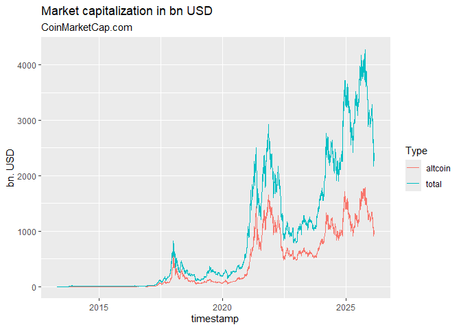

# crypto2 [](https://github.com/sstoeckl/crypto2)

# Historical Cryptocurrency Prices for Active and Delisted Tokens!

This is a modification of the original `crypto` package by [jesse
vent](https://github.com/JesseVent/crypto). It is entirely set up to use
means from the `tidyverse` and provides `tibble`s with all data
available via the web-api of
[coinmarketcap.com](https://coinmarketcap.com/). **It does not require
an API key but in turn only provides information that is also available
through the website of
[coinmarketcap.com](https://coinmarketcap.com/).**

It allows the user to retrieve

- [`crypto_listings()`](https://www.sebastianstoeckl.com/crypto2/dev/reference/crypto_listings.md)
  a list of all coins that were historically listed on CMC (main dataset
  to avoid delisting bias) according to the [CMC API
  documentation](https://coinmarketcap.com/api/documentation/v1/#operation/getV1CryptocurrencyListingsHistorical)
- [`crypto_list()`](https://www.sebastianstoeckl.com/crypto2/dev/reference/crypto_list.md)
  a list of all coins that are listed as either being *active*,
  *delisted* or *untracked* according to the [CMC API
  documentation](https://coinmarketcap.com/api/documentation/v1/#operation/getV1CryptocurrencyMap)
- [`crypto_info()`](https://www.sebastianstoeckl.com/crypto2/dev/reference/crypto_info.md)
  a list of all information available for all available coins according
  to the [CMC API
  documentation](https://coinmarketcap.com/api/documentation/v1/#operation/getV1CryptocurrencyInfo)
- [`crypto_history()`](https://www.sebastianstoeckl.com/crypto2/dev/reference/crypto_history.md)
  the **most powerful** function of this package that allows to download
  the entire available history for all coins covered by CMC according to
  the [CMC API
  documentation](https://coinmarketcap.com/api/documentation/v1/#operation/getV1CryptocurrencyOhlcvHistorical)
- [`crypto_global_quotes()`](https://www.sebastianstoeckl.com/crypto2/dev/reference/crypto_global_quotes.md)
  a dataset of historical global crypto currency market metrics to the
  [CMC API
  documentation](https://coinmarketcap.com/api/documentation/v1/#operation/getV1GlobalmetricsQuotesHistorical)
- [`fiat_list()`](https://www.sebastianstoeckl.com/crypto2/dev/reference/fiat_list.md)
  a mapping of all fiat currencies available via the [CMC WEB
  API](https://coinmarketcap.com/api/documentation/v1/#operation/getV1FiatMap)
  (note: since v2.0.0 only USD is available)
- [`exchange_list()`](https://www.sebastianstoeckl.com/crypto2/dev/reference/exchange_list.md)
  a list of all exchanges available as either being *active*, *delisted*
  or *untracked* according to the [CMC API
  documentation](https://coinmarketcap.com/api/documentation/v1/#operation/getV1ExchangeMap)
- [`exchange_info()`](https://www.sebastianstoeckl.com/crypto2/dev/reference/exchange_info.md)
  a list of all information available for all given exchanges according
  to the [CMC API
  documentation](https://coinmarketcap.com/api/documentation/v1/#operation/getV1ExchangeInfo)

# Changelog

## Version 2.0.5.99 (development)

[`crypto_info()`](https://www.sebastianstoeckl.com/crypto2/dev/reference/crypto_info.md)
and
[`exchange_info()`](https://www.sebastianstoeckl.com/crypto2/dev/reference/exchange_info.md)
have been made more robust against CMC API changes. Both functions now
use a column **allowlist** instead of a denylist: only known, documented
columns are retained, so any new or unknown fields added by CMC —
including list-type fields that would previously break the output — are
silently ignored. This should eliminate the recurring patch releases
caused by CMC adding new columns.

## Version 2.0.2/2.0.3/2.0.4/2.0.5 (September 2025)

Slight change in api output broke
[`crypto_info()`](https://www.sebastianstoeckl.com/crypto2/dev/reference/crypto_info.md)
(new additional column). Fixed.

## Version 2.0.1 (July 2024)

Slight change in api output broke
[`crypto_info()`](https://www.sebastianstoeckl.com/crypto2/dev/reference/crypto_info.md).
Fixed.

## Version 2.0.0 (May 2024)

After a major change in the api structure of coinmarketcap.com, the
package had to be rewritten. As a result, many functions had to be
rewritten, because data was not available any more in a similar format
or with similar accuracy. Unfortunately, this will potentially break
many users implementations. Here is a detailed list of changes:

- [`crypto_list()`](https://www.sebastianstoeckl.com/crypto2/dev/reference/crypto_list.md)
  has been modified and delivers the same data as before.
- [`exchange_list()`](https://www.sebastianstoeckl.com/crypto2/dev/reference/exchange_list.md)
  has been modified and delivers the same data as before.
- [`fiat_list()`](https://www.sebastianstoeckl.com/crypto2/dev/reference/fiat_list.md)
  has been modified and no longer delivers all available currencies and
  precious metals (therefore only USD and Bitcoin are available any
  more).
- [`crypto_listings()`](https://www.sebastianstoeckl.com/crypto2/dev/reference/crypto_listings.md)
  needed to be modified, as multiple base currencies are not available
  any more. Also some of the fields downloaded from CMC might have
  changed. It still retrieves the latest listings, the new listings as
  well as historical listings. The fields returned have somewhat
  slightly changed. Also, no sorting is available any more, so if you
  want to download the top x CCs by market cap, you have to download all
  CCs and then sort them in R.
- [`crypto_info()`](https://www.sebastianstoeckl.com/crypto2/dev/reference/crypto_info.md)
  has been modified, as the data structure has changed. The fields
  returned have somewhat slightly changed.
- [`crypto_history()`](https://www.sebastianstoeckl.com/crypto2/dev/reference/crypto_history.md)
  has been modified. It still retrieves all the OHLC history of all the
  coins, but is slower due to an increased number of necessary api
  calls. The number of available intervals is strongly limited, but
  hourly and daily data is still available. Currently only USD and BTC
  are available as quote currencies through this library.
- [`crypto_global_quotes()`](https://www.sebastianstoeckl.com/crypto2/dev/reference/crypto_global_quotes.md)
  has been modified. It still produces a clear picture of the global
  market, but the data structure has somewhat slightly changed.

## Installation

You can install `crypto2` from CRAN with

``` r
install.packages("crypto2")
```

or directly from github with:

``` r
# install.packages("devtools")
devtools::install_github("sstoeckl/crypto2")
```

## Package Contribution

The package provides API free and efficient access to all information
from <https://coinmarketcap.com> that is also available through their
website. It uses a variety of modification and web-scraping tools from
the `tidyverse` (especially `purrr`).

As this provides access not only to **active** coins but also to those
that have now been **delisted** and also those that are categorized as
**untracked**, including historical pricing information, this package
provides a valid basis for any **Asset Pricing Studies** based on crypto
currencies that require **survivorship-bias-free** information. In
addition to that, the package maintainer is currently working on also
providing **delisting returns** (similarly to CRSP for stocks) to also
eliminate the **delisting bias**.

## Package Usage

First we load the `crypto2`-package and download the set of active coins
from <https://coinmarketcap.com> (additionally one could load delisted
coins with `only_active=FALSE` as well as untracked coins with
`add_untracked=TRUE`).

``` r
library(crypto2)
library(dplyr)
#> 
#> Attache Paket: 'dplyr'
#> Die folgenden Objekte sind maskiert von 'package:stats':
#> 
#>     filter, lag
#> Die folgenden Objekte sind maskiert von 'package:base':
#> 
#>     intersect, setdiff, setequal, union

# List all active coins
coins <- crypto_list(only_active=TRUE)
```

Next we download information on the first three coins from that list.

``` r
# retrieve information for all (the first 3) of those coins
coin_info <- crypto_info(coins, limit=3, finalWait=FALSE)
#> ❯ Scraping crypto info
#> 
#> ❯ Processing crypto info
#> 

# and give the first two lines of information per coin
coin_info
#> # A tibble: 4 × 45
#>      id name     symbol slug   category description date_added actual_time_start
#>   <int> <chr>    <chr>  <chr>  <chr>    <chr>       <date>     <chr>            
#> 1     1 Bitcoin  BTC    bitco… coin     "## What I… 2010-07-13 2010-07-13T00:05…
#> 2     2 Litecoin LTC    litec… coin     "## What I… 2013-04-28 2013-04-28T18:45…
#> 3     2 Litecoin LTC    litec… coin     "## What I… 2013-04-28 2013-04-28T18:45…
#> 4     3 Namecoin NMC    namec… coin     "Namecoin … 2013-04-28 2013-04-28T18:45…
#> # ℹ 37 more variables: status <chr>, is_bn <int>, sub_status <chr>,
#> #   notice <chr>, alert_type <int>, alert_link <chr>,
#> #   latest_update_time <dttm>, watch_list_ranking <int>, date_launched <date>,
#> #   is_audited <lgl>, display_tv <int>, is_infinite_max_supply <int>,
#> #   tv_coin_symbol <chr>, cdp_total_holder <chr>, holder_historical_flag <lgl>,
#> #   holder_list_flag <lgl>, holders_flag <lgl>, ratings_flag <lgl>,
#> #   analysis_flag <lgl>, socials_flag <lgl>, …
```

In a next step we show the logos of the three coins as provided by
<https://coinmarketcap.com>.


In addition we show tags provided by <https://coinmarketcap.com>.

``` r
coin_info %>% select(slug,tags) %>% tidyr::unnest(tags) %>% group_by(slug) %>% slice(1,n())
#> # A tibble: 6 × 2
#> # Groups:   slug [3]
#>   slug     tags$slug       $name           $category $status $priority
#>   <chr>    <chr>           <chr>           <chr>       <int>     <int>
#> 1 bitcoin  mineable        Mineable        OTHERS          1         5
#> 2 bitcoin  binance-listing Binance Listing CATEGORY        0         5
#> 3 litecoin mineable        Mineable        OTHERS          1         5
#> 4 litecoin binance-listing Binance Listing CATEGORY        0         5
#> 5 namecoin mineable        Mineable        OTHERS          1         5
#> 6 namecoin platform        Platform        CATEGORY        1         5
```

Additionally: Here are some urls pertaining to these coins as provided
by <https://coinmarketcap.com>.

``` r
coin_info %>% dplyr::pull(urls) %>% .[[1]] %>% unlist()
#>                            urls.website                      urls.technical_doc 
#>                  "https://bitcoin.org/"       "https://bitcoin.org/bitcoin.pdf" 
#>                          urls.explorer1                          urls.explorer2 
#>              "https://blockchain.info/"     "https://live.blockcypher.com/btc/" 
#>                          urls.explorer3                          urls.explorer4 
#>        "https://blockchair.com/bitcoin"       "https://explorer.viabtc.com/btc" 
#>                          urls.explorer5                        urls.source_code 
#> "https://www.okx.com/web3/explorer/btc"    "https://github.com/bitcoin/bitcoin" 
#>                      urls.message_board                             urls.reddit 
#>               "https://bitcointalk.org"          "https://reddit.com/r/bitcoin"
```

In a next step we download time series data for these coins.

``` r
# retrieve historical data for all (the first 3) of them
coin_hist <- crypto_history(coins, limit=3, start_date="20210101", end_date="20210105", finalWait=FALSE)
#> ❯ Scraping historical crypto data
#> 
#> ❯ Processing historical crypto data
#> 

# and give the first two times of information per coin
coin_hist %>% group_by(slug) %>% slice(1:2)
#> # A tibble: 6 × 18
#> # Groups:   slug [3]
#>      id slug     name     symbol timestamp           ref_cur_id ref_cur_name
#>   <int> <chr>    <chr>    <chr>  <dttm>              <chr>      <chr>       
#> 1     1 bitcoin  Bitcoin  BTC    2021-01-01 23:59:59 2781       USD         
#> 2     1 bitcoin  Bitcoin  BTC    2021-01-02 23:59:59 2781       USD         
#> 3     2 litecoin Litecoin LTC    2021-01-01 23:59:59 2781       USD         
#> 4     2 litecoin Litecoin LTC    2021-01-02 23:59:59 2781       USD         
#> 5     3 namecoin Namecoin NMC    2021-01-01 23:59:59 2781       USD         
#> 6     3 namecoin Namecoin NMC    2021-01-02 23:59:59 2781       USD         
#> # ℹ 11 more variables: time_open <dttm>, time_close <dttm>, time_high <dttm>,
#> #   time_low <dttm>, open <dbl>, high <dbl>, low <dbl>, close <dbl>,
#> #   volume <dbl>, market_cap <dbl>, circulating_supply <dbl>
```

Similarly, we could download data on an hourly basis.

``` r
# retrieve historical data for all (the first 3) of them
coin_hist_m <- crypto_history(coins, limit=3, start_date="20210101", end_date="20210102", interval ="1h", finalWait=FALSE)
#> ❯ Scraping historical crypto data
#> 
#> ❯ Processing historical crypto data
#> 

# and give the first two times of information per coin
coin_hist_m %>% group_by(slug) %>% slice(1:2)
#> # A tibble: 6 × 18
#> # Groups:   slug [3]
#>      id slug     name     symbol timestamp           ref_cur_id ref_cur_name
#>   <int> <chr>    <chr>    <chr>  <dttm>              <chr>      <chr>       
#> 1     1 bitcoin  Bitcoin  BTC    2021-01-01 01:59:59 2781       USD         
#> 2     1 bitcoin  Bitcoin  BTC    2021-01-01 02:59:59 2781       USD         
#> 3     2 litecoin Litecoin LTC    2021-01-01 01:59:59 2781       USD         
#> 4     2 litecoin Litecoin LTC    2021-01-01 02:59:59 2781       USD         
#> 5     3 namecoin Namecoin NMC    2021-01-01 01:59:59 2781       USD         
#> 6     3 namecoin Namecoin NMC    2021-01-01 02:59:59 2781       USD         
#> # ℹ 11 more variables: time_open <dttm>, time_close <dttm>, time_high <dttm>,
#> #   time_low <dttm>, open <dbl>, high <dbl>, low <dbl>, close <dbl>,
#> #   volume <dbl>, market_cap <dbl>, circulating_supply <dbl>
```

Since v2.0.0, only USD and BTC are available as quote currencies. The
available currencies can be checked with
[`fiat_list()`](https://www.sebastianstoeckl.com/crypto2/dev/reference/fiat_list.md):

``` r
fiats <- fiat_list()
fiats
#> # A tibble: 1 × 4
#>      id name                 sign  symbol
#>   <int> <chr>                <chr> <chr> 
#> 1  2781 United States Dollar $     USD
```

We can download the same time series priced in Bitcoin instead of USD:

``` r
# retrieve historical data for all (the first 3) of them, priced in BTC
coin_hist2 <- crypto_history(coins, convert="BTC", limit=3, start_date="20210101", end_date="20210105", finalWait=FALSE)
#> ❯ Scraping historical crypto data
#> 
#> ❯ Processing historical crypto data
#> 

# and give the first two times of information per coin
coin_hist2 %>% group_by(slug,ref_cur_name) %>% slice(1:2)
#> # A tibble: 6 × 18
#> # Groups:   slug, ref_cur_name [3]
#>      id slug     name     symbol timestamp           ref_cur_id ref_cur_name
#>   <int> <chr>    <chr>    <chr>  <dttm>              <chr>      <chr>       
#> 1     1 bitcoin  Bitcoin  BTC    2021-01-01 23:59:59 1          BTC         
#> 2     1 bitcoin  Bitcoin  BTC    2021-01-02 23:59:59 1          BTC         
#> 3     2 litecoin Litecoin LTC    2021-01-01 23:59:59 1          BTC         
#> 4     2 litecoin Litecoin LTC    2021-01-02 23:59:59 1          BTC         
#> 5     3 namecoin Namecoin NMC    2021-01-01 23:59:59 1          BTC         
#> 6     3 namecoin Namecoin NMC    2021-01-02 23:59:59 1          BTC         
#> # ℹ 11 more variables: time_open <dttm>, time_close <dttm>, time_high <dttm>,
#> #   time_low <dttm>, open <dbl>, high <dbl>, low <dbl>, close <dbl>,
#> #   volume <dbl>, market_cap <dbl>, circulating_supply <dbl>
```

We can also download historical listings and listing information (add
`quote = TRUE`):

``` r
latest_listings <- crypto_listings(which="latest", limit=10, quote=TRUE, finalWait=FALSE)
latest_listings
#> # A tibble: 5,001 × 33
#>       id name        symbol slug        market_pair_count circulating_supply
#>    <int> <chr>       <chr>  <chr>                   <int>              <dbl>
#>  1     1 Bitcoin     BTC    bitcoin                 12564          19993700 
#>  2     2 Litecoin    LTC    litecoin                 1507          76881714.
#>  3     3 Namecoin    NMC    namecoin                    7          14736400 
#>  4     5 Peercoin    PPC    peercoin                   43          30066955.
#>  5     8 Feathercoin FTC    feathercoin                12         236600238 
#>  6    22 Luckycoin   LKY    luckycoin                  10          19204751 
#>  7    25 Goldcoin    GLC    goldcoin                   12          43681422.
#>  8    26 Junkcoin    JKC    junkcoin                    4          17843261 
#>  9    35 Phoenixcoin PXC    phoenixcoin                 4          93172468.
#> 10    42 Primecoin   XPM    primecoin                   6          57040070.
#> # ℹ 4,991 more rows
#> # ℹ 27 more variables: self_reported_circulating_supply <dbl>,
#> #   total_supply <dbl>, is_active <int>, last_updated <date>, date_added <chr>,
#> #   wrapped_staked_mc_rank <int>, is_cmc20sponsored <lgl>, cmc_rank <int>,
#> #   max_supply <dbl>, ref_currency <chr>, price <dbl>, volume24h <dbl>,
#> #   volume_percent_change <dbl>, market_cap <dbl>, percent_change1h <dbl>,
#> #   percent_change24h <dbl>, percent_change7d <dbl>, percent_change30d <dbl>, …
```

[`crypto_global_quotes()`](https://www.sebastianstoeckl.com/crypto2/dev/reference/crypto_global_quotes.md)
retrieves global aggregate market statistics for CMC:

``` r
all_quotes <- crypto_global_quotes(which="historical", quote=TRUE)
#> ❯ Scraping historical global data
#> 
#> ❯ Processing historical crypto data
#> 
all_quotes
#> # A tibble: 4,682 × 18
#>    timestamp  btc_dominance eth_dominance         score USD_total_market_cap
#>    <date>             <dbl>         <dbl>         <dbl>                <dbl>
#>  1 2013-04-29          94.2             0 1367193600000           1583440000
#>  2 2013-04-30          94.4             0 1367280000000           1686950016
#>  3 2013-05-01          94.4             0 1367366400000           1637389952
#>  4 2013-05-02          94.1             0 1367452800000           1333880064
#>  5 2013-05-03          94.2             0 1367539200000           1275410048
#>  6 2013-05-04          93.9             0 1367625600000           1169469952
#>  7 2013-05-05          94.0             0 1367712000000           1335379968
#>  8 2013-05-06          94.1             0 1367798400000           1370880000
#>  9 2013-05-07          94.4             0 1367884800000           1313900032
#> 10 2013-05-08          94.4             0 1367971200000           1320509952
#> # ℹ 4,672 more rows
#> # ℹ 13 more variables: USD_total_volume24h <dbl>,
#> #   USD_total_volume24h_reported <dbl>, USD_altcoin_volume24h <dbl>,
#> #   USD_altcoin_volume24h_reported <dbl>, USD_altcoin_market_cap <dbl>,
#> #   USD_original_score <chr>, active_cryptocurrencies <int>,
#> #   active_market_pairs <int>, active_exchanges <int>,
#> #   total_cryptocurrencies <int>, total_exchanges <int>, origin_id <chr>, …
```

We can use those quotes to plot information on the aggregate market
capitalization:

``` r
all_quotes %>% select(timestamp, USD_total_market_cap, USD_altcoin_market_cap) %>% 
  tidyr::pivot_longer(cols = 2:3, names_to = "Market Cap", values_to = "bn. USD") %>% 
  tidyr::separate(`Market Cap`,into = c("Currency","Type","Market","Cap")) %>% 
  dplyr::mutate(`bn. USD`=`bn. USD`/1000000000) %>% 
  ggplot2::ggplot(ggplot2::aes(x=timestamp,y=`bn. USD`,color=Type)) + ggplot2::geom_line() +
  ggplot2::labs(title="Market capitalization in bn USD", subtitle="CoinMarketCap.com")
```



Last and least, one can get information on exchanges. For this download
a list of active/inactive/untracked exchanges using
[`exchange_list()`](https://www.sebastianstoeckl.com/crypto2/dev/reference/exchange_list.md):

``` r
exchanges <- exchange_list(only_active=TRUE)
exchanges
#> # A tibble: 923 × 6
#>       id name         slug  is_active first_historical_data last_historical_data
#>    <int> <chr>        <chr>     <int> <date>                <date>              
#>  1    16 Poloniex     polo…         1 2018-04-26            2026-02-23          
#>  2    21 BTCC         btcc          1 2018-04-26            2026-02-23          
#>  3    24 Kraken       krak…         1 2018-04-26            2026-02-23          
#>  4    34 Bittylicious bitt…         1 2018-04-26            2026-02-23          
#>  5    36 CEX.IO       cex-…         1 2018-04-26            2026-02-23          
#>  6    37 Bitfinex     bitf…         1 2018-04-26            2026-02-23          
#>  7    42 HitBTC       hitb…         1 2018-04-26            2026-02-23          
#>  8    50 EXMO         exmo          1 2018-04-26            2026-02-23          
#>  9    61 Okcoin       okco…         1 2018-04-26            2025-06-20          
#> 10    68 Indodax      indo…         1 2018-04-26            2026-02-23          
#> # ℹ 913 more rows
```

and then download information on “binance” and “kraken”:

``` r
ex_info <- exchange_info(exchanges %>% filter(slug %in% c('binance','kraken')), finalWait=FALSE)
#> ❯ Scraping crypto info
#> 
#> ❯ Processing exchange info
#> 
ex_info
#> # A tibble: 2 × 22
#>      id name    slug    logo   description date_launched notice is_hidden status
#>   <int> <chr>   <chr>   <chr>  <chr>       <date>        <chr>      <int> <chr> 
#> 1    24 Kraken  kraken  https… "## What I… 2011-07-28    ""             0 active
#> 2   270 Binance binance https… "## What I… 2017-07-14    ""             0 active
#> # ℹ 13 more variables: type <chr>, maker_fee <dbl>, taker_fee <dbl>,
#> #   platform_id <int>, dex_status <int>, wallet_source_status <int>,
#> #   alert_type <int>, alert_link <chr>, gif_logo_tag <int>, tags <list>,
#> #   countries <lgl>, fiats <list>, urls <list>
```

Then we can access information on the fee structure,

``` r
ex_info %>% select(contains("fee"))
#> # A tibble: 2 × 2
#>   maker_fee taker_fee
#>       <dbl>     <dbl>
#> 1      0.02      0.05
#> 2      0.02      0.04
```

or the fiat currencies allowed:

``` r
ex_info %>% select(slug,fiats) %>% tidyr::unnest(fiats)
#> # A tibble: 95 × 2
#>    slug    fiats
#>    <chr>   <chr>
#>  1 kraken  USD  
#>  2 kraken  EUR  
#>  3 kraken  GBP  
#>  4 kraken  CHF  
#>  5 kraken  AUD  
#>  6 kraken  CAD  
#>  7 binance ARS  
#>  8 binance AUD  
#>  9 binance BRL  
#> 10 binance CHF  
#> # ℹ 85 more rows
```

### Author/License

- **Sebastian Stöckl** - Package Creator, Modifier & Maintainer -
  [sstoeckl on github](https://github.com/sstoeckl) and [academic
  website](https://www.sebastianstoeckl.com)

This project is licensed under the MIT License - see the \<license.md\>
file for details\</license.md\>

### Acknowledgments

- Thanks to the team at <https://coinmarketcap.com> for the great work
  they do, especially to [Alice Liu (Research
  Lead)](https://www.linkedin.com/in/alicejingliu/) and [Aaron
  K.](https://www.linkedin.com/in/aaroncwk/) for their support with
  regard to information on delistings.
- Thanks to Jesse Vent for providing the (not fully research compatible)
  [`crypto`](https://github.com/JesseVent/crypto)-package that inspired
  this package.
